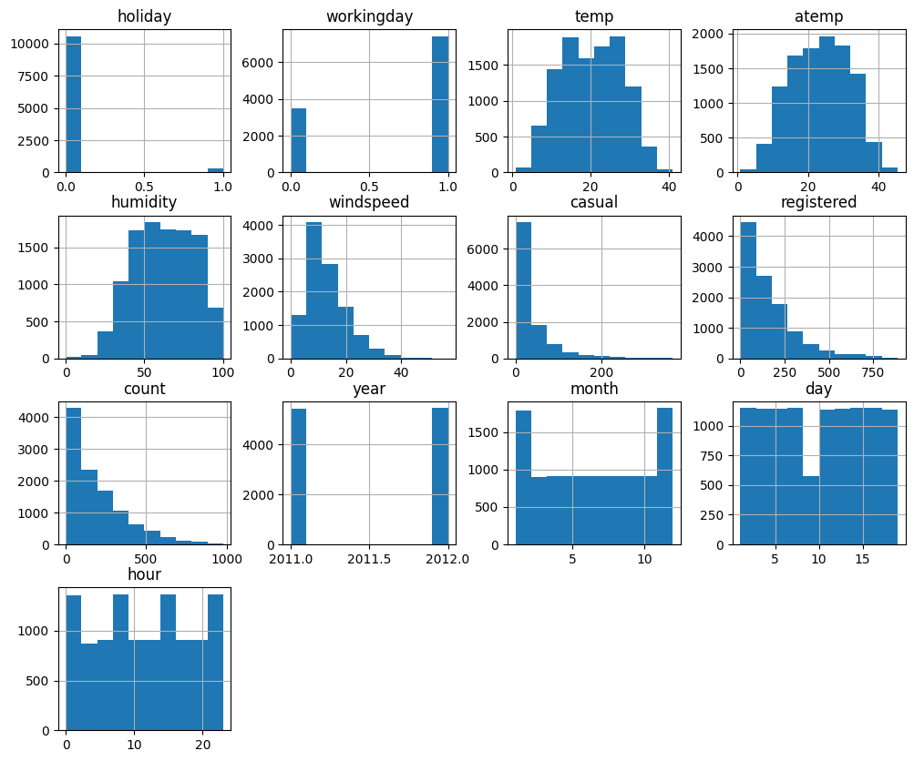
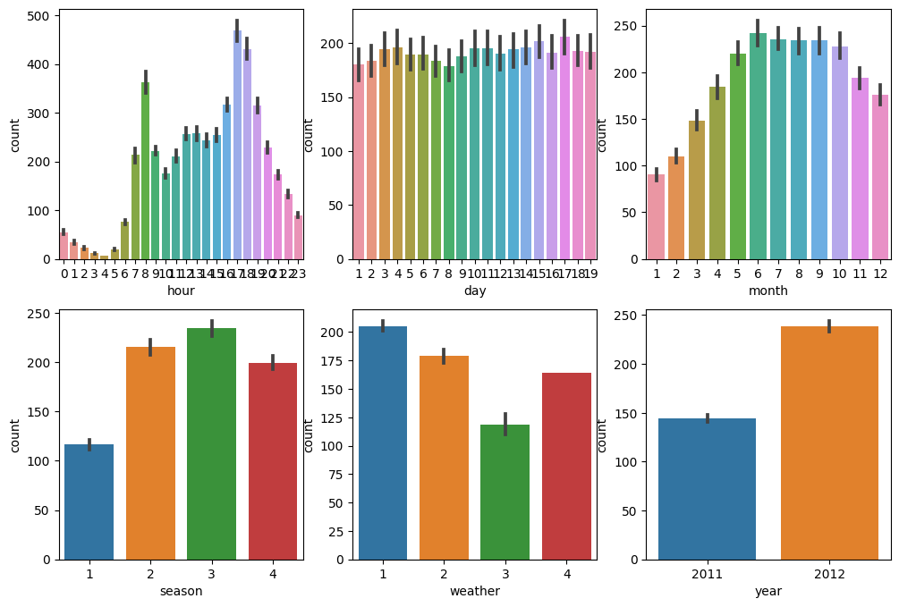
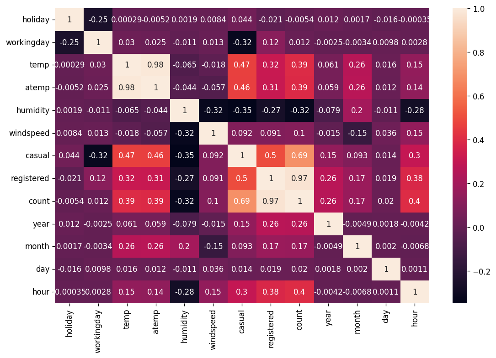
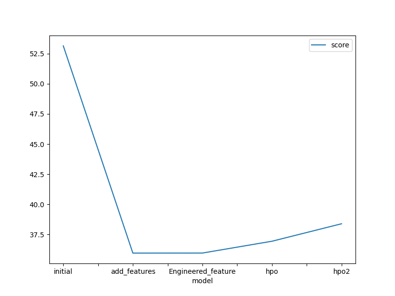
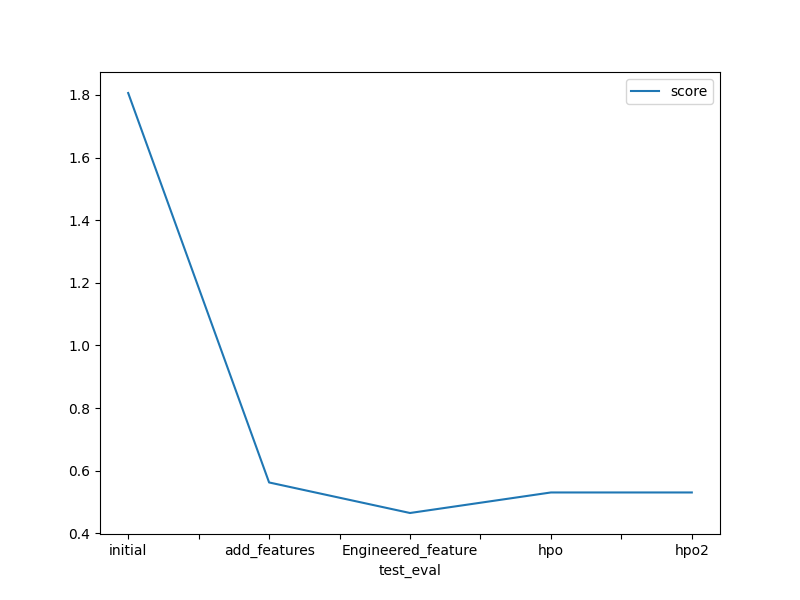

# Report: Predict Bike Sharing Demand with AutoGluon Solution
#### Saurabh Bhardwaj

## Initial Training
### What did you realize when you tried to submit your predictions? What changes were needed to the output of the predictor to submit your results?

We have completed total 5 experiments to achieve best possible predictive model. The details are as following:

- Base Line Model Submission [Model: Based on the default setting using AutoGluOn]
- Added Features Submission (EDA + Feature Engineering) [Model: New feature created using `datetime` column]
- Engineered Features Submission [Model: New feature `temp_humidity_interaction`]
- Hyperparameter Optimization (HPO) - GBM hyper-parameter optimisation Submission
- Hyperparameter Optimization (HPO) - XGB hyper-parameter optimisation Submission

As Kaggle does not accepts the submissions with negative predictions values obtained from the predictor, we have replaced all negative outputs from respective predictors and replaced with 0.

Output: While submitting predictions obtained from all these five experiments, some of the experiments delivered negative predictions values.

### What was the top ranked model that performed?

From all above mentioned experiments, best model is WeightedEnsemble_L3 with validation RMSE score of 35.962630 and the best Kaggle test score of 0.44798. To conduct this experiment, we have added few extra features using exploratory data analysis (EDA) and feature engineering. The details of feature engineering are given below. 

## Exploratory data analysis and feature creation
### What did the exploratory analysis find and how did you add additional features?

With the help of `datetime` feature we have created `date`, `year`, `month`, and `hour` features. Other feature called `temp_humidity_interaction` was created based on `temperatur` and `humidity`. These features really helped to improve the over all model performance from 53.14 to 35.96. 

In the end `datetime` feature was dropped from the dataset. 

In addition, as `season` and `weather` were categorical features, we assigned them categorical.

### Data Distribution of different features

### total frequency of some of the columns from the dataset

### Feature correlation heatmap among features.

### How much better did your model preform after adding additional features and why do you think that is?

## Hyper parameter tuning
### How much better did your model preform after trying different hyper parameters?
Indeed, hyperparameter tuning helped model to learn better and accuracy has also increased from 53 to 37, but the result on kaggle score is not proven to be much effective. It might also because of shorter running time. With different hyperparameter and many experiments, the result might improve which will be tested in our next experiments.

For kaggle score, additional features from datetime feature and temperature and humidity has given the best performance with kaggle score of 0.46. 

### If you were given more time with this dataset, where do you think you would spend more time?
Wtih more time, we would like to investigate further hyperparameter tuning with longer running time with combination of different parameters and high quality present.

### Create a table with the models you ran, the hyperparameters modified, and the kaggle score.

|model|ime_limit|presets|num_epochs|num_boost_round|num_trials|num_folds|searcher|score|
|--|--|--|--|--|--|--|--|--|
|initial|600|best_quality|default|default|default|default|default|1.80601|
|add_features|600|best_quality|default|default|default|default|default|0.56283|
|add_engineered_features|600|best_quality|default|default|default|default|default|0.46532|
|hypo0-lightGBM|600|best_quality|default|50|4|5|auto|0.53087|
|hypo2-lightGBM & NeuralNetworks|600|best_quality|15|100|8|9|random|0.53087|

### Create a line plot showing the top model score for the three (or more) training runs during the project.

### Create a line plot showing the top kaggle score for the three (or more) prediction submissions during the project.

## Summary

In this project, we have trained a classifier to predict bike-sharing demand using AutoGluOn platform. Based on the detailed EDA and baseline model, we have identified sereval different features such as `date`, `year`, `month`, `hour` and `temp_humidity_interaction`. By adding extra features, model performance has improved. We have also search for best hyper-parameters for the two best classifiers and finally selected model which was trained with engineered features. we have also found that the hyper-parameter tuning with AutoGluOn depends on many factors such as duration and range of selected parameters and might need a lot of experiments. 
